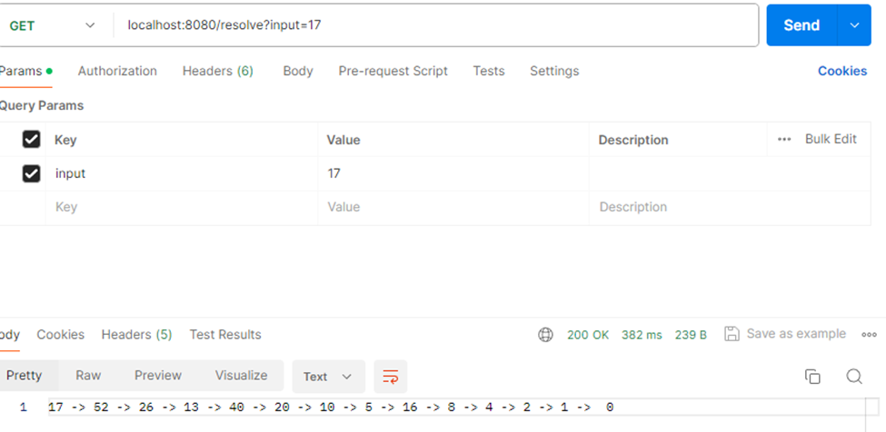
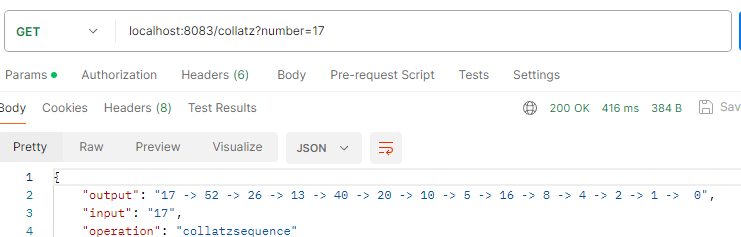
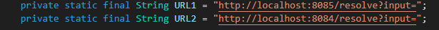

# Parcial2-AREP

Funcionamiento del modulo de collatz
Solo tiene un enpoint llamado resolve que escucha en el Puerto 8085, ejemplo de funcionamineto:

Ejemplo de funcionamiento llamando al proxy, al endpoint collatz?numer=17

Parametros a cambiar via variables de entorno

Aca se colocarias las url de aws

todos  los modulos se conectaros exitosamente en este momento haria falta el despliegue de ec2